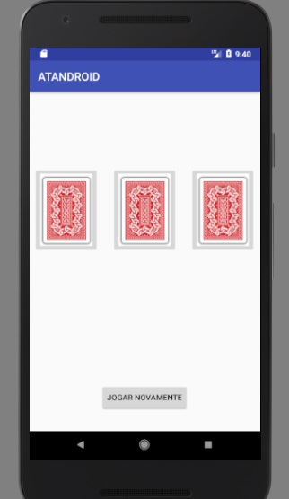
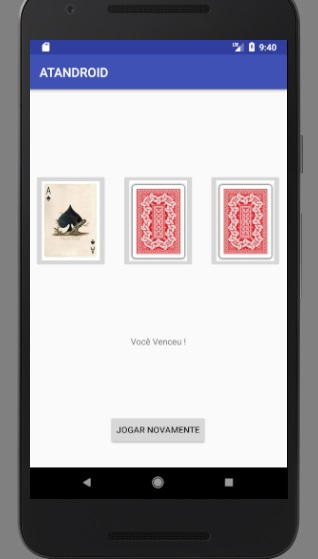
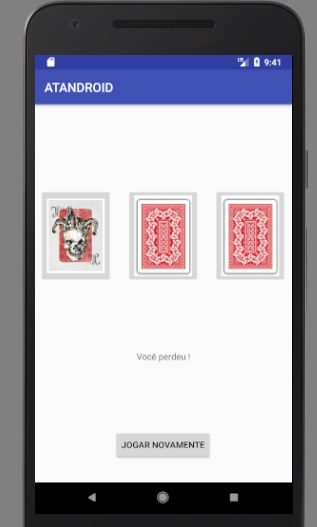

# Projeto da faculdade Infnet utilizando Android para avaliar as competências dos alunos.

Jogo de adivinhação,o objetivo é desenvolver um jogo de adivinhação. Deverão ser exibidos três cartas para o usuário ele deverá selecionar uma e clicar em confirmar. Se a carta selecionada for uma carta coringa, deverá ser exibido uma mensagem de que o usuário perdeu, exibindo uma opção para ele tentar novamente. Caso seja vencedor, a mensagem deverá mostrar que ele ganhou, com o botão para tentar novamente também. Lembre-se que duas cartas devem ser coringa, e somente uma deve permitir a vitória.  

